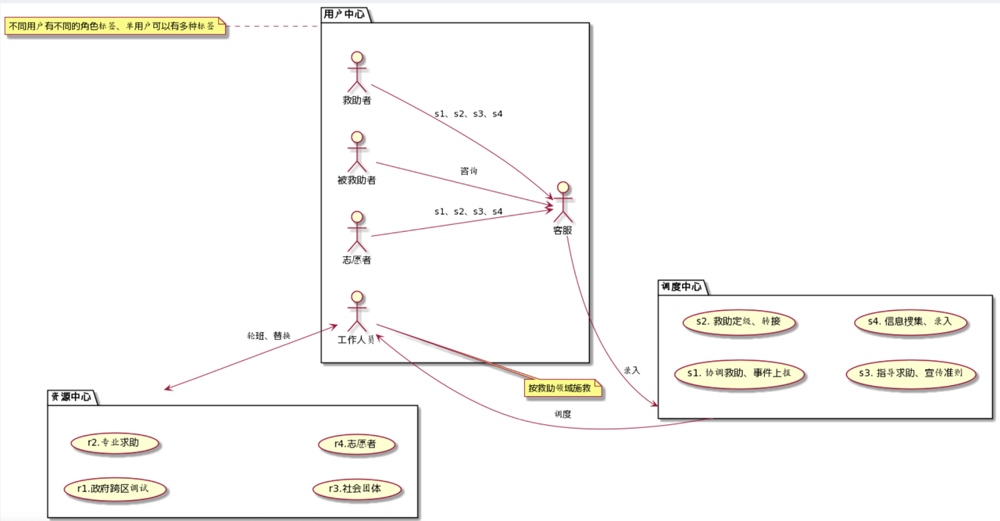

## 技能列表

|ID |技能|
--- | ---
1 | 红十字救护员
2 | AHA急救员
3 | AHA急救员导师
4 | 红十字应急救护员师资
5 | AHA BLS基础生命支持
6 | AHA ACLS高级生命支持
7 | 护士资格证
8 | 医师资格证
9 | PADI OW开放水域
10 | PADI AOW 开放水域进阶潜水员
11 | PADI RESCUE DIVER 救援潛水員
12 | 游泳救生员初级（国家职业资格五级）
13 | 游泳救生员中级（国家职业资格四级）
14 | 游泳救生员初级（国家职业资格五级）
15 | 应急救援员五级/初级工
16 | 应急救援员四级/中级工
17 | 应急救援员三级/高级工
18 | 应急救援员二级/技师
19 | 应急救援员一级/高级技师
20 | 环球计划

## 装备列表

| ID | 装备 |
--- | ---
1 | 个人防护
2 | 救生设备
3 | 灭火设备
4 | 医疗急救
5 | 通信设备
6 | 救援交通
7 | 后勤保障
8 | 搜索检测

## 急救关系图

